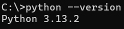
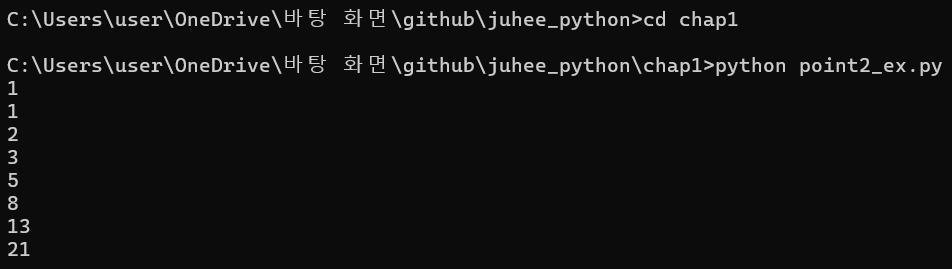

### 파이썬 개요

**파이썬**

- 인터프리터 방식의 언어
- 다른 언어에 비해 간결한 작성으로 스크립트 언어라고도 함

**실행**

- cmd 창에서 명령어를 통해 설치 버전 확인가능
- `python --version`
- 

**대화형 모드**

- cmd 창에서 c:\ 위치에서 아래 명령어를 통해 진입가능
- `python`
- 종료 할 경우
- `exit() 또는 quit()`
- 

**스크립트 파일 저장 및 실행**

- py 확장자를 붙여 저장
- cmd 창을 통해 실행할 경우 파일이 위치한 폴더에서 아래 명령어를 통해 실행
- `python 파일명.py`
- 

**주석**

- 문장 앞머리에 # 를 붙이면 주석 처리되어 코드에서 무시된다
- vscode에서의 단축키는 Ctrl + /
