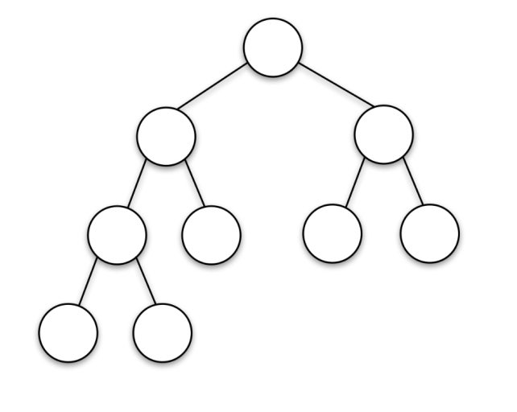
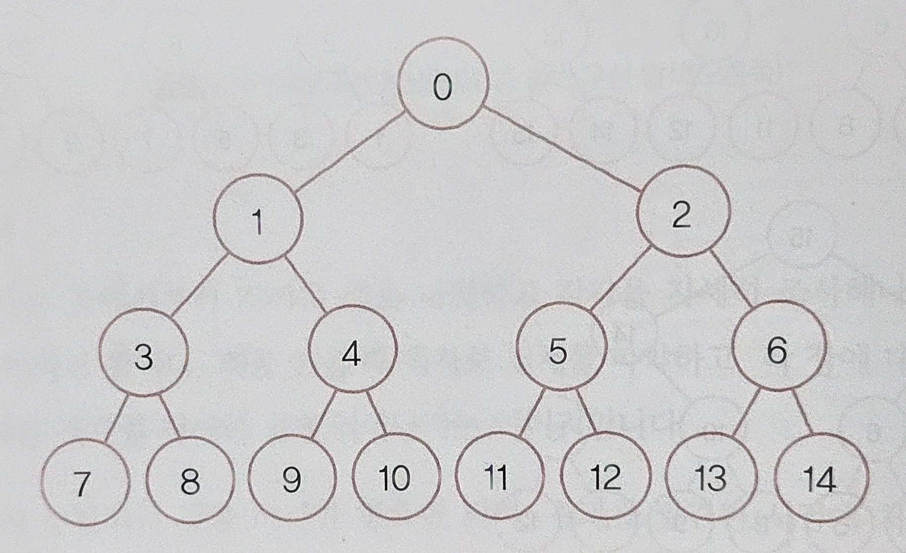

### 트리구조탐색

**계층 구조 데이터 검색**

- 컴퓨터 폴더의 저장된 파일을 검색할 때와 같이, 계층 구조의 데이터를 검색해야 하는 경우
- **너비 우선 탐색**과 **깊이 우선 탐색**의 두 가지 방법을 사용할 수 있다
- 트리구조: 원(노드, 마디)과 선(에지, 가지)로 구조를 표현, 나뭇가지를 뒤짚어 놓은 형태와 유사하여 트리구조라고 한다
- 

**너비 우선 탐색**

- 시작 지점에서 가까운 것을 나열하고 하나씩 조사하는 방법
- 결과를 발견한 시점에 처리를 종료할 수 있어 처리속도가 빠르다
- 최단 경로 탐색의 경우 너비 우선 탐색이 더 빠르다
- 
- 실제 프로그램으로 구현

  - 위의 사진 속 노드는 리스트의 각 요소로 구현된다
  - `tree[0] = [1, 2]`의 자식을 가진다는 표현

  ```python
  tree = [
    [1, 2],
    [3, 4],
    [5, 6],
    [7, 8],
    [9, 10],
    [11, 12],
    [13, 14],
  ]
  ```

  1. 검색할 초기값을 설정한다(0)
  2. 검색할 노드가 없으면 종료, 있으면 다음 위치를 맨 앞에서 얻는다
  3. 실행결과 인덱스를 순서대로 출력하므로 트리구조를 위에서부터 차례대로 출력(탐색)한 것을 알 수 있다

  - 자식 노드를 큐(data)의 뒤에 넣기 때문에, 먼저 들어온 노드가 먼저 탐색되는 것

  ```python
  data = [0]

  while len(data) > 0:
  pos = data.pop(0) # 맨 앞부터 순서대로 탐색하게 됨
  print(pos, end=" ")
  for i in tree[pos]:
    data.append(i)
  # 출력결과: 0 1 2 3 4 5 6 7 8 9 10 11 12 13 14
  ```

**깊이 우선 탐색**

- 원하는 방향으로 탐색을 진행하다가 더 진행되지 않으면 이전 위치로 돌아가는 방법(백트랙)
- 재귀를 사용하는 경우가 일반적
- 전위순회, 중위순회, 후위순회가 있다
- 너비우선탐색보다 메모리 사용량을 줄일 수 있다
- `전위 순회`

  1. 맨 왼쪽 노드를 차례로 탐색하고 저장하는 처리를 맨 아래 노드까지 반복
  2. 맨 아래 노드와 같은 깊이, 자식이 없는 오른쪽 노드 탐색 후 결과 저장
  3. 맨 아래 노드의 부모노드와 같은 깊이면서, 같은 부모를 갖는 오른쪽 노드 탐색
  4. 해당 작업을 원하는 노드를 찾거나, 모든 노드를 탐색할 때까지 반복

  ```python
  def search(pos):
    print(pos, end=" ")
    for i in tree[pos]:
        search(i)  # 재귀적으로 탐색

  search(0)
  # 출력결과:0 1 3 7 8 4 9 10 2 5 11 12 6 13 14
  ```

- `후위순회`

  1. 맨 왼쪽 아래의 자식 노드부터 시작한다
  2. 같은 부모를 가진 형제 노드 -> 부모노드의 순서로 탐색
  3. 부모노드의 형제노드가 자식노드를 가질 경우 해당하는 자식노드부터 탐색
  4. 해당 작업을 원하는 노드를 찾거나, 모든 노드를 탐색할 때까지 반복

  ```python
  def searchL(pos):
  for i in tree[pos]:
      searchL(i)
  print(pos, end=" ")

  searchL(0)
  # 출력결과: 7 8 3 9 10 4 1 11 12 5 13 14 6 2 0
  ```

- `중위순회`

  - 이진트리(자식이 2명)에서만 정의된다

  1. 맨 왼쪽 아래의 자식 노드부터 시작한다
  2. 부모 노드를 탐색하고, 부모 노드의 오른쪽 자식노드가 있다면 탐색한다
  3. 오른쪽 자식 노드가 없다면 다시 부모노드로 돌아가, 위의 새로운 부모노드를 탐색한다
  4. 해당 작업을 원하는 노드를 찾거나, 모든 노드를 탐색할 때까지 반복

  ```python
  def searchM(pos):
    if len(tree[pos]) == 2:
        searchM(tree[pos][0])
        print(pos, end=" ")
        searchM(tree[pos][1])
    elif len(tree[pos]) == 1:
        searchM(tree[pos][0])
        print(pos, end=" ")
    else:
        print(pos, end=" ")

  searchM(0)
  # 출력결과: 7 3 8 1 9 4 10 0 11 5 12 2 13 6 14
  ```

**[실습파일](point3_ex.py)**
