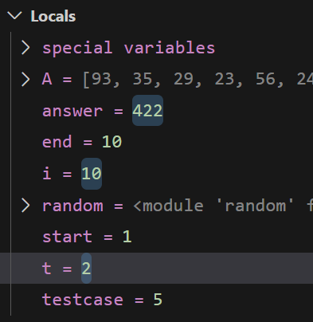
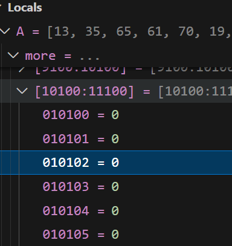
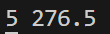

### 코드의 논리 오류를 어떻게 잡을까?

**디버깅의 중요성**

- 프로그램에서 발생하는 문법 오류나 논리 오류를 찾아 바로잡는 과정을 디버깅이라고 한다
- 디버깅하는 법
  - 디버깅하고자 하는 줄에 중단점을 설정(여러개 설정가능)
  - 디버깅 기능을 실행하여 진행, 코드를 1줄씩 실행하거나 다음 중단점까지 실행하며 변숫값이 의도한 대로 변하는지 확인
  - 원하는 수식을 입력해 논리오류 파악가능
- vscode: 코드의 왼쪽에 마우스 오버하여 빨간점 클릭하면 중단점 설정, f5또는 run버튼에서 디버깅 모드 직접 클릭하여 디버깅 기능 사용가능

**디버깅 활용사례**

- 배열의 주어진 범위의 합을 2로 나눈 몫을 구하는 코드

(1) 변수 초기화 오류

- 중단점

```python
start, end = map(int, input().split())
```

- 
- t가 2이므로 두번째 케이스를 진행하고 있는데, answer의 값이 0이 아니다
- 초기화 로직이 빠졌거나 문제가 있음을 의미함

(2) 인덱스 범위 지정 오류

```python
A = [0] * (100001)

for i in range(0, 10001):
    A[i] = random.randrange(1, 101)
```

- 
- A[10001] 부터 모든 값이 0이다
- 배열 A의 크기가 100001이므로 배열의 크기는 0~100000이어야 함
- 디버깅을 통해 혹시 모를 입력 실수를 대비할 수 있음

(3) 잘못된 변수 사용

```python
print(str(testcase) + " " + str(answer / 2))
```

- 
- 본래 의도한 바는 n번 케이스의 결과 answer를 출력하는 것인데 실제 케이스 번호는 t에 저장되고 있음에도 변수이름(테스트케이스는 전체 케이스 수)이 비슷하여 잘못 사용하고 있다
- 2번 케이스의 결과임에도 전체 케이스의 수인 5가 출력되고 있다

(4) 파이썬 자동 형 변환

- 문제는 결과 몫을 자연수로 표기하라고 했으나 결과는 소숫점(float)을 표시하고 있는데 이는 연산자를 착각했기 때문이다
- 연산자 // 를 사용하면 int형의 몫을 구할 수 있다

```python
print(str(t) + " " + str(answer // 2))
```

**[실습파일](chap02.py)**
